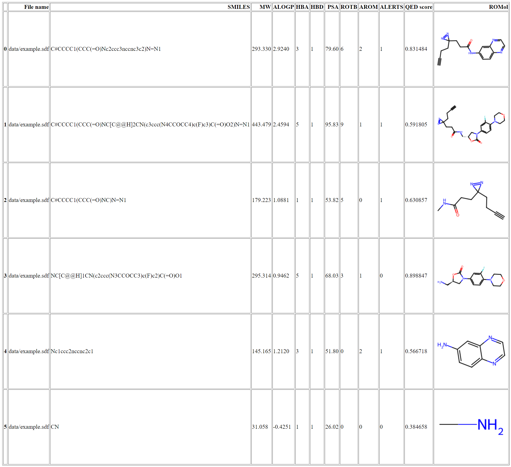

# Calculate QED Scores with calculateQED.py

## Purpose

Calculate a QED score and properties related to drug-likeness from a .sdf structure file.

## Installation

### Install conda enviroment with provided .yml file

    conda create -f rdkit_enviroment.yml

### Manually install dependancies

* rdkit
* openpyxl
* pandas

## Input file format

1. Input must be an SDF file.
    * Input files (.sdf) can be made in ChemDraw by saving as MDL SDfile V3000 (*.sdf).
    * All chemical structures in the input SDF files will be analyzed.

## Arguments

### Required (one of the following):

    -f (--file): Specify path of an input .sdf file.
    -d (--directory): Specify path of an input directory containing .sdf file(s).

### Optional:

    -o (--out): Specify an output directory (relative to cwd), default="QED_scores_out".

## Usage examples

### Activate rdkit conda enviroment before running

    activate rdkit

### Calculate QED score for all files in a directory

    python calculateQED.py --directory path_to_directory

### Calculate QED score for all structures in a single file

    python calculateQED.py --file path_to_file

## Output files

1. Excel file
    * File name
    * SMILES
    * QED properties
    * QED score

2. HTML file
    * File name
    * SMILES
    * QED properties
    * QED score
    * Chemical structure

